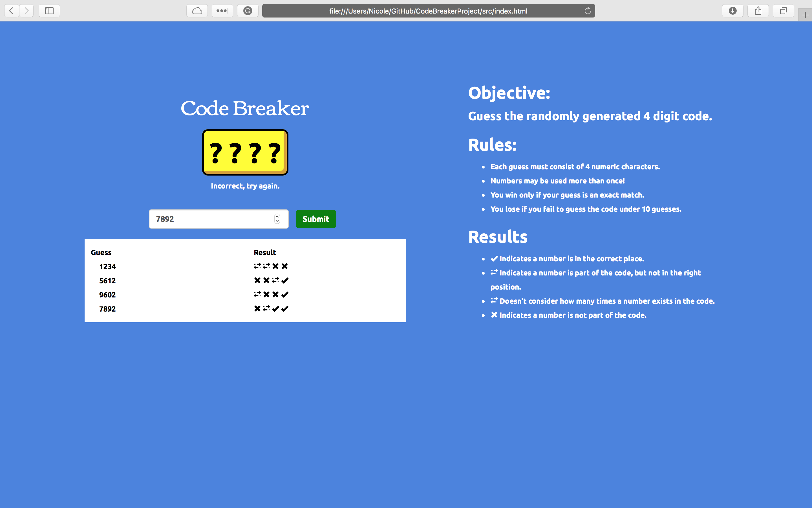
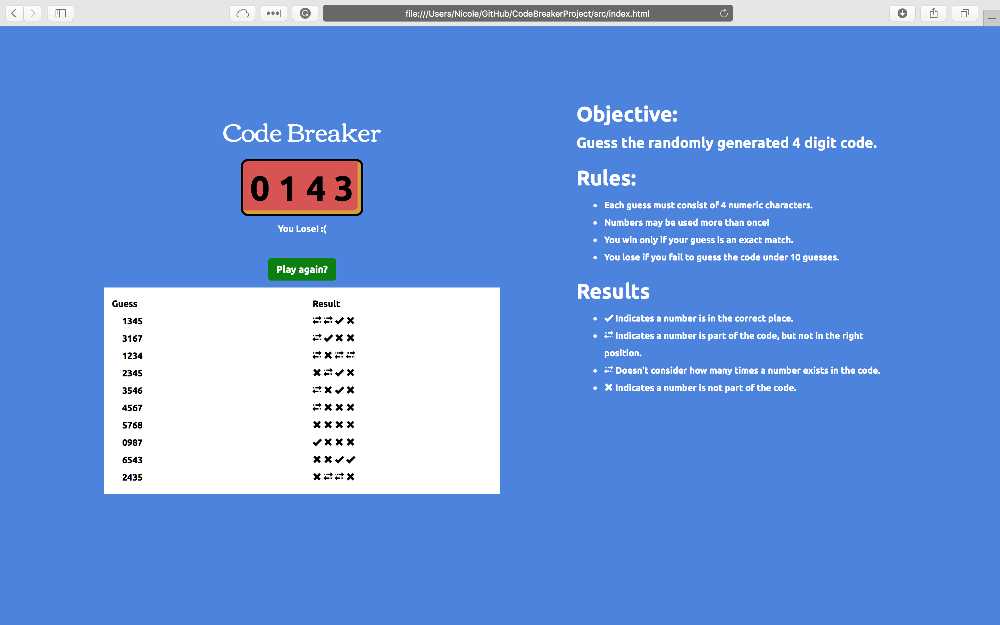
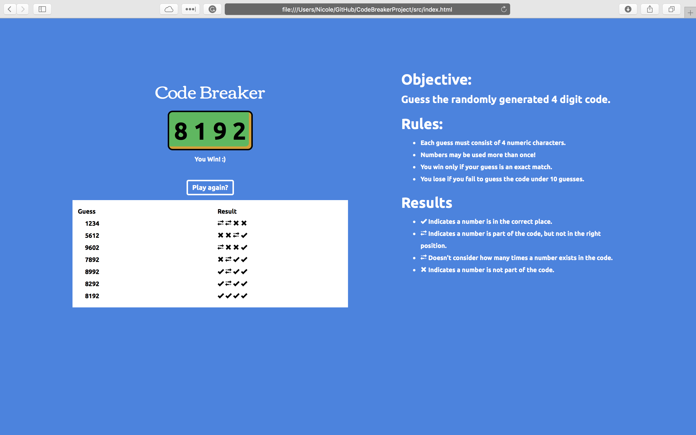

# Code Breaker

A mastermind inspired game.

## Current Tasks
- [x] main.js - created all the functions to make game work backend
- [x] main.css - updated and added to file for styling
- [x] index.html - given at point of fork, made minor changes

### Game Screenshot

## Built With

* Javascript

## Acknowledgments

* Inspired by [Code School](https://www.codeschool.com/)'s Code Breaker Project. ([Code School Version](https://codeschool-projects.github.io/CodeBreakerProject/))
* Starting point forked from their [GitHub](https://github.com/codeschool-projects/CodeBreakerProject)
